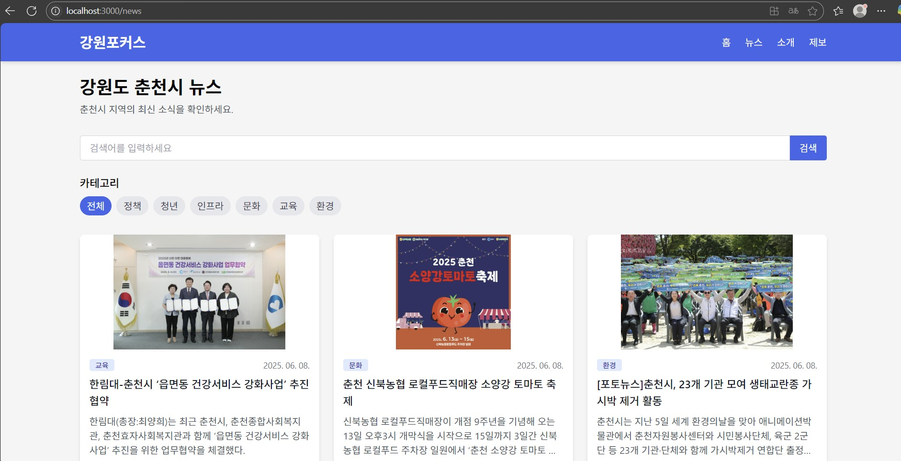

# 강원포커스 (Gangwon Focus)

> 강원도 지역 주민을 위한 맞춤형 뉴스 통합 플랫폼

강원포커스는 강원도 지역의 소멸 위기와 정보 불균형 문제를 해결하고자 개발된  
**지역 기반 뉴스 플랫폼**입니다.  
React 기반 사용자 인터페이스와 JSP 기반 관리자 시스템을 Spring Boot 백엔드와 연동하여,  
사용자는 관심 지역 뉴스를 조회하고 관리자는 뉴스를 직접 등록·관리할 수 있도록 설계되었습니다.

---

## 📌 주요 기능 (Features)

- 지역 선택을 통한 뉴스 필터링 및 검색
- 뉴스 카테고리(정책, 청년, 문화 등) 분류 및 키워드 검색 기능
- 뉴스 상세 조회, 이미지 출력, 댓글 등록 및 삭제
- 사용자 제보 및 피드백 제출 폼
- 관리자 로그인 및 세션 인증
- 관리자 전용 뉴스 등록/수정/삭제 UI
- 관리자 전용 제보 내역 확인 및 대응 기능

---

## 🛠 사용 기술 (Tech Stack)

### 🔹 Frontend
- React
- Axios (REST API 연동)
- React Router DOM

### 🔹 Backend
- Java 17
- Spring Boot 3.4.5
- Spring Data JPA
- JSP + JSTL (관리자 페이지)
- MySQL (로컬 DB)
- Lombok, Embedded Tomcat
- Spring MVC Interceptor (세션 인증)

---

## 📷 주요 화면 (Screenshots)

### 🏠 메인 페이지


### 📰 뉴스 목록 페이지


### 📄 뉴스 상세 페이지


### 📨 제보 페이지


### 🔐 관리자 로그인


### 🧭 관리자 메인


### 📬 문의 목록


---

## 📁 폴더 구조 (프로젝트 구성)

```
WebServer-Project/
├── frontend-react/           # React 사용자 페이지
├── backend-spring/           # Spring Boot 백엔드 (JSP 포함)
│   └── src/
│       ├── controller/       # NewsApiController, AdminController 등
│       ├── domain/           # NewsArticle, ContactMessage 엔티티
│       ├── repository/       # JPA Repository
│       ├── config/           # WebMvcConfigurer, Interceptor
│       └── webapp/
│           └── WEB-INF/views/
│               ├── login.jsp
│               ├── newsRegister.jsp
│               ├── adminNewsList.jsp
│               ├── contactList.jsp
│               ├── header.jsp, sidebar.jsp
├── database/                 # 초기 schema.sql, test data
└── README.md
```

---

## ⚙️ 실행 방법 (Getting Started)

### 🔹 프론트엔드 실행 (React)

```bash
cd frontend-react
npm install
npm start
```

### 🔹 백엔드 실행 (Spring Boot)

```bash
cd backend-spring
./mvnw spring-boot:run
```

> MySQL DB 연동 필요 (`application.yml` 설정 확인)

---

## 👨‍💻 팀원 (Team)

| 이름       | 역할                            |
|------------|---------------------------------|
| 최승혁     | 팀장, 프론트엔드 개발, JSP 관리자 시스템, 백엔드 연동, GitHub 관리 |

---

## 📚 참고자료 (References)

- 통계청 도시소멸위험지수 (2023)
- 국토연구원 지역정책 보고서
- Spring Boot 공식 문서: https://spring.io/projects/spring-boot  
- React 공식 문서: https://reactjs.org  
- WebMvcConfigurer: 이미지 경로 노출 설정
- JSP & JSTL 실습 자료

---

## 📄 라이선스 (License)

본 프로젝트는 학습 및 포트폴리오용으로 사용되며, 상업적 이용은 제한됩니다.
